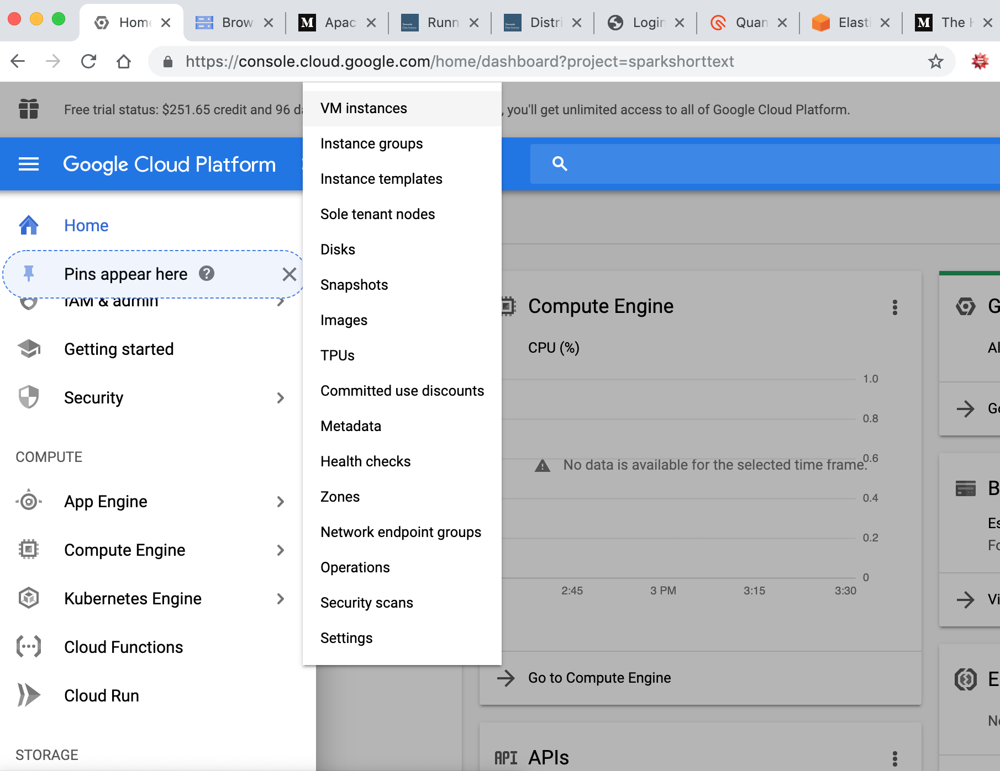
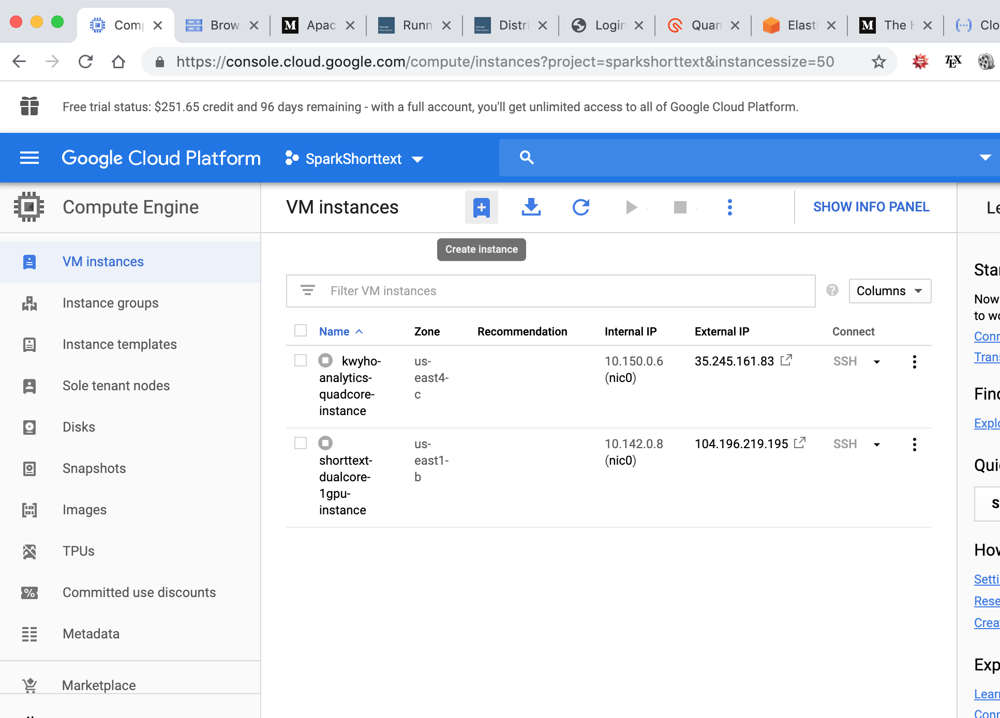
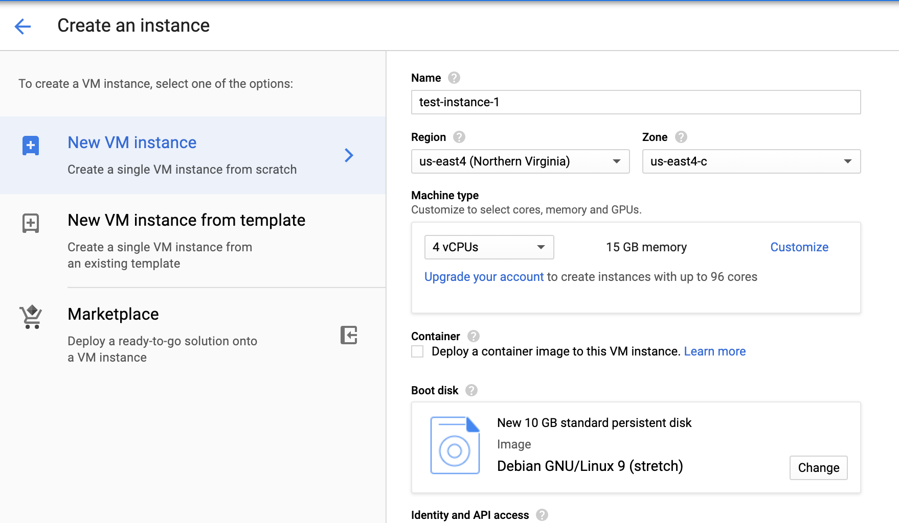
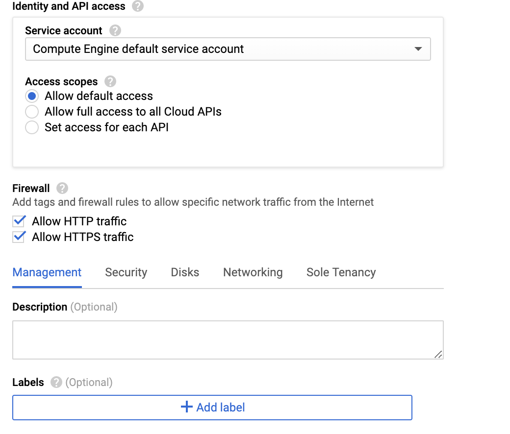
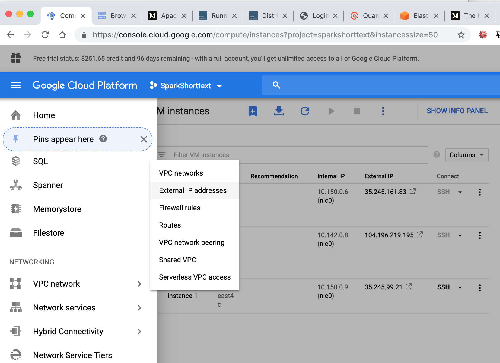
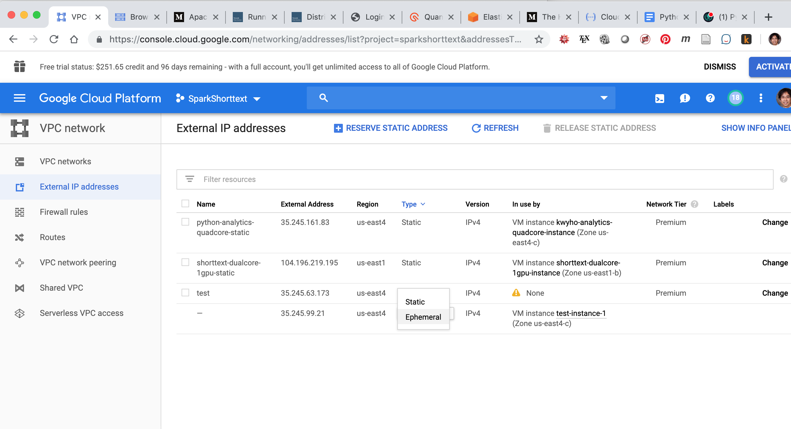
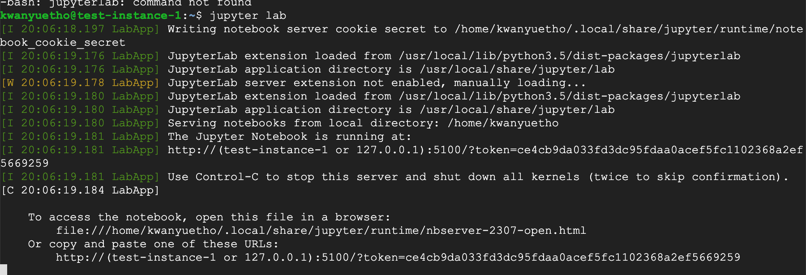
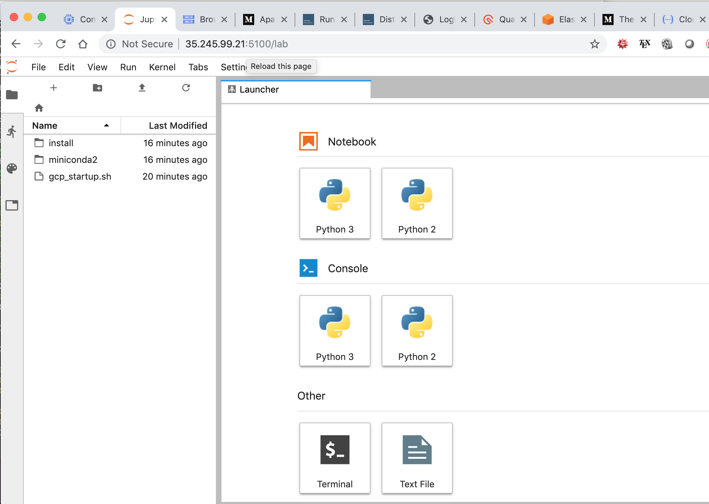

# Setting Up VM Instance in Google Cloud Platform for JupyterLab

This repository contains recipes and scripts for setting up
a VM instance in Google Cloud Platform for using Jupyter
Notebooks and JupyterLab.

## Setting Up a VM Instance

Please set up an account in Google Cloud Platform.

Then click on the button on the left-top corner, choose
**Compute Engine** >> **VM Instances**.



Then click on the "+" sign that has alternate text "create instances".



Then set up the name, choose your region, and select
the machine types that you need.



And remember to check "Allow HTTP traffic" and
"Allow HTTPS traffic". Then click "Create".



After a few minutes, the VM instance is up.

## Cloud Setup

Open "SSH" of the instance by clicking on it. Then run

```
wget 'https://raw.githubusercontent.com/stephenhky/cloudplatform-startup-config/master/gcp_startup.sh' -O gcp_startup.sh
```

and then

```
source ./gcp_startup.sh
```

## Creating Static IP and Firewall Rule

After setting up, we want to make the IP to this VM
instance static. To do this, click on the button on
the left-top corner, and then click **VPC Network**
>> **External IP addresses**.



For the instance created, change the Type from "Ephemeral"
to "Static".



Then give a name to this static IP address.

Then click on the button on the left-top corner, and then
**VPC Network** >> **Firewall rules**. Then click
"Create Firewall Rules". Then give it a name. Choose
"All instances in the network" in "Targets", "0.0.0.0/0" for
"Source IP ranges". And check "tcp" and type "5100".

Then click "Create".

## Open Jupyter in Browser

To open Jupyter Notebook or JupyterLab in browser,
in the SSH window, type

```
jupyter lab
```

or

```
jupyter notebook
```

Then you will see something like this:



You can see the HTTP link down there. Copy that link
to the browser, and replace the string inside bracket
with the static IP address. Then open this address on your browser
and then it is open:




# Creating VirtualEnv

## Creating


## Activating


## Adding to Jupyter